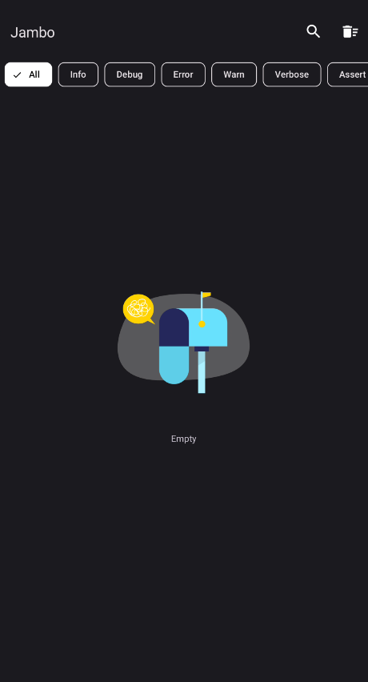
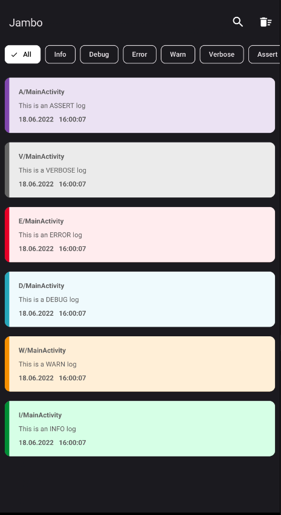
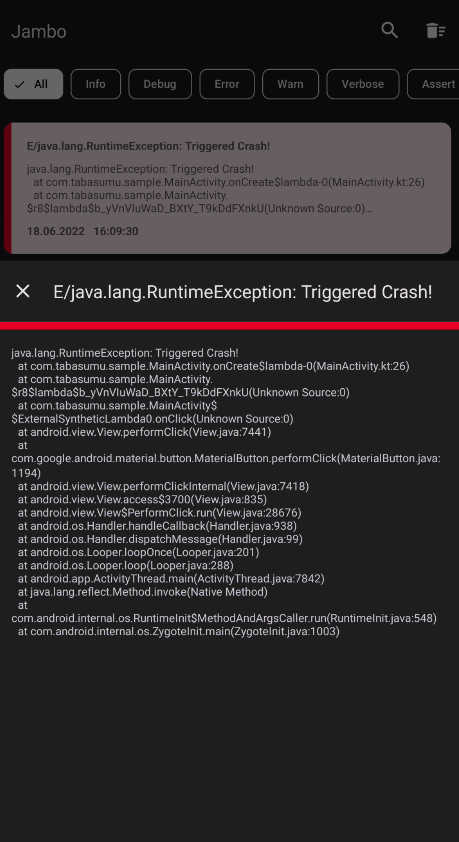
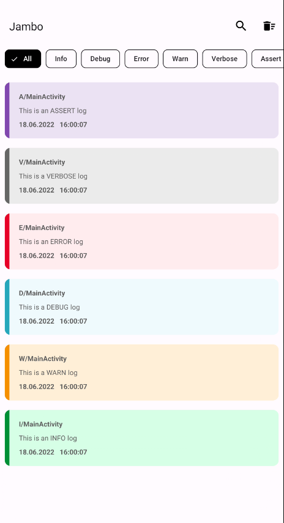

<div align="center">

<p align="center"></p>

# Jambo [](https://jitpack.io/#tabasumu/jambo)
  


Jambo is an open source remote **logging library**. <br/>
For those who would like to see their logs remotely on their android device Jambo is the library for you. Jambo installs a separate debug app for intercepting all logs called with the Jambo class.

[Installation](#installation) •
[Usage](#usage) •
[Contributing](#contributing) •
[Credits](#credits) •
[License](#license) 

</div>

## Installation ([Kotlin DSL](#kotlin-dsl) • [Groovy](#groovy) )

### Kotlin DSL
* Install `jitpack`

Locate your `build.gradle.kts` file in the root project and add :
```kotlin
allprojects {
    repositories {
        google()
        mavenCentral()
        maven { setUrl("https://jitpack.io") } // add this line
    }
}
```

For those with a higher gradle version, find `settings.gradle.kts` in the root project folder and add : 
```kotlin
dependencyResolutionManagement {
    repositoriesMode.set(RepositoriesMode.FAIL_ON_PROJECT_REPOS)
    repositories {
        google()
        mavenCentral()
        maven { setUrl("https://jitpack.io") } // add this line
    }
}
```
* Add Jambo Dependency

In your app module find `build.gradle.kts` and add : 

```kotlin
  implementation("com.github.tabasumu:jambo:$version")
```

* Sync gradle and proceed use the library


### Groovy

* Install `jitpack`

Locate your `build.gradle` file in the root project and add :
``` groovy
allprojects {
    repositories {
        google()
        mavenCentral()
        maven { url "https://jitpack.io" } // add this line
    }
}
```

For those with a higher gradle version, find `settings.gradle` and add : 
```groovy
dependencyResolutionManagement {
    repositoriesMode.set(RepositoriesMode.FAIL_ON_PROJECT_REPOS)
    repositories {
        google()
        mavenCentral()
        maven { url 'https://jitpack.io' }  // add this line
    }
}
```

* Add Jambo dependency

 In your app module find `build.gradle` and add : 

```groovy
  implementation 'com.github.tabasumu:jambo:$version'
```

<br/>

## Usage

- Initialize Jambo in the App module

```kotlin
// Kotlin
class App : Application {

    Jambo.Builder()
        .enableNotifications(true) // not required & is false by default 
        .build()

}
```
```java
// Java
class App extends Application {

    new Jambo.Builder()
        .enableNotifications(true) // not required & is false by default 
        .build()

}
```

- Log using the Jambo class
```Java

    // Kotlin and Java

    Jambo.w("This is a WARN log")
    Jambo.i("This is an INFO log")
    Jambo.d("This is a DEBUG log")
    Jambo.e("This is an ERROR log")
    Jambo.v("This is a VERBOSE log")
    Jambo.wtf("This is an ASSERT log")

```
- Open the Jambo app and view your logs (`search`, `filter`, `view` or `clear`)
<p>




</p>
<br/>

## Contributing


  [](https://github.com/tabasumu/jambo/issues?q=is%3Aissue+is%3Aopen+label%3A%22good+first+issue%22)    

Your contributions are especially welcome.
Whether it comes in the form of code patches, ideas, discussion, bug reports, encouragement or criticism, your input is needed.

Visit [issues](https://github.com/tabasumu/jambo/issues) to get started.

<br/>

## Credits
[Timber](https://github.com/JakeWharton/timber)

## License
    Copyright 2022 Tabasumu

    Licensed under the Apache License, Version 2.0 (the "License");
    you may not use this file except in compliance with the License.
    You may obtain a copy of the License at

       http://www.apache.org/licenses/LICENSE-2.0

    Unless required by applicable law or agreed to in writing, software
    distributed under the License is distributed on an "AS IS" BASIS,
    WITHOUT WARRANTIES OR CONDITIONS OF ANY KIND, either express or implied.
    See the License for the specific language governing permissions and
    limitations under the License.